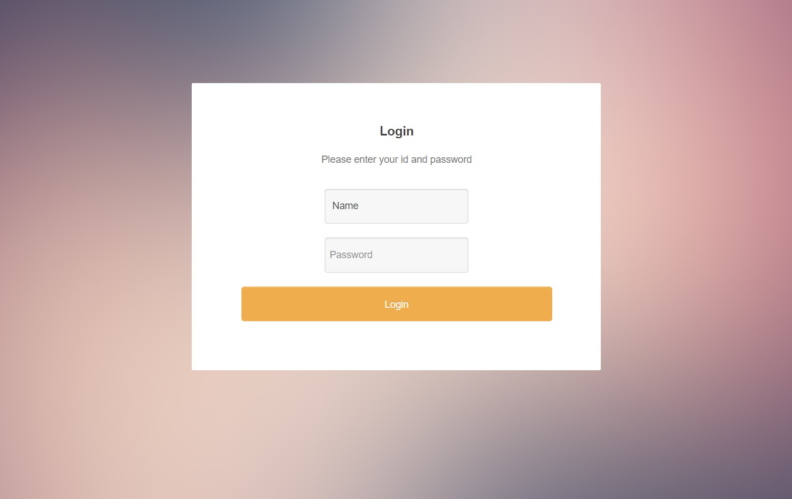
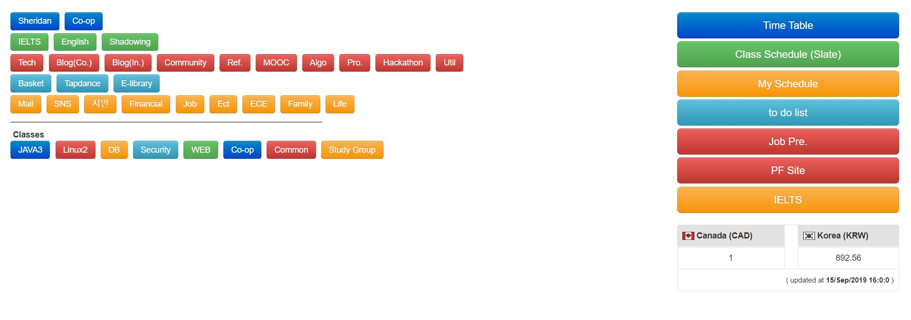

# [My Home](https://sehyunnoh.github.io/myhome/)
## 1. Login Page

## 2. Main Page
> - Link all information related to the class
> - Deployed as public through GitHub page, it can be checked by mobile.
> - Real-time checking of exchange rate information between Korea and Canada

## Technologies
> HTML5, CSS3, JavaScript, ES6, Bootstrap, Google Analytics, jQuery, NPM, markdown.js

